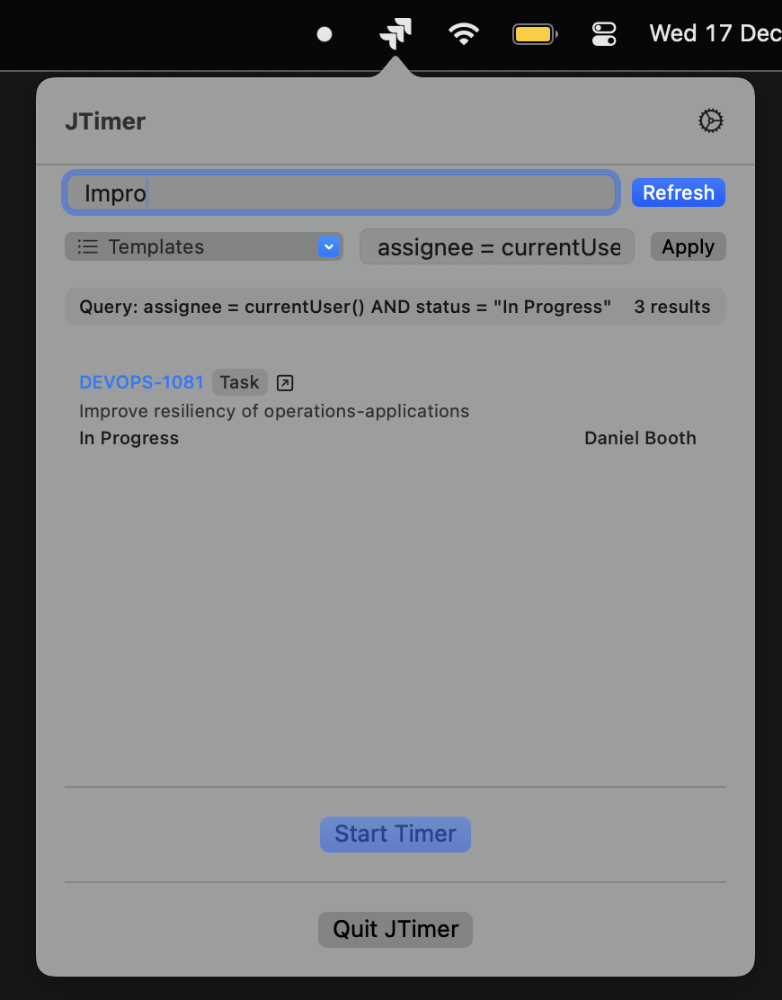

# JTimer - Jira Time Tracking Menu Bar App

A macOS menu bar application for tracking time on Jira issues with automatic worklog posting.

## Features

- **Menu Bar Integration**: Lives in your menu bar, shows timer status with visual indicators
- **Jira Cloud Integration**: Uses Personal Access Token (PAT) authentication
- **JQL Support**: Filter issues using custom JQL queries or search within results
- **Automatic Time Logging**: Automatically posts work logs to Jira when you stop the timer
- **Console Logging**: Timer events are logged to console (notifications disabled in SPM build)
- **Secure Storage**: API tokens stored securely in macOS Keychain
- **Syncs with Tempo**: Syncs with Jira integrated time tracking tools like Tempo

## Screenshots



## Installation

### From Release

1. Download the latest `JTimer-x.x.x.zip` from the [Releases](https://github.com/yourusername/jira-time-tracker/releases) page
2. Extract the ZIP file
3. Move `JTimer.app` to your Applications folder
4. Launch JTimer from Applications or Spotlight

### First Launch Security Note

If you see a "damaged" or "unidentified developer" warning:

1. Open **Terminal** and run:
   ```bash
   xattr -cr /Applications/JTimer.app
   ```
2. Try opening JTimer again

This removes the quarantine attribute that macOS adds to downloaded apps. The app is ad-hoc signed and safe to run.

### Building from Source

```bash
# Clone the repository
git clone https://github.com/yourusername/jira-time-tracker.git
cd jira-time-tracker

# Run development build
./run.sh

# Or build distributable app
./build-app.sh
```

